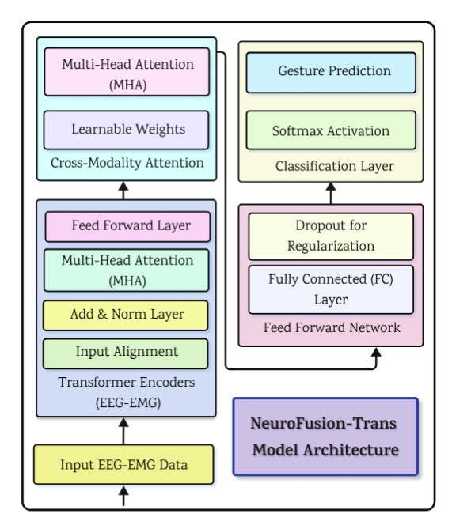

# NeuroFusion-Trans

**NeuroFusion-Trans: A Novel Transformer-Based EEG-EMG Fusion Model for Assistive Robotics**  
*Accepted at IEEE Access 2025*  

---

##  Overview

NeuroFusion-Trans is a transformer-based framework for upper-limb gesture recognition using EEG and EMG signals. It enhances user intent decoding for assistive robotics by:

- Dynamically synchronizing neural (EEG) and muscular (EMG) signals  
- Learning cross-modal dependencies through **cross-modality attention**  
- Adapting to user-specific signal changes via **online learning**

---

## Key Contributions

- **Temporal Synchronization**: Resampling + FFT-based cross-correlation  
- **Cross-Modality Attention**: Learns joint EEG-EMG feature space  
- **Online Adaptive Learning**: Updates model on-the-fly per user  


---

## Datasets

This repository uses **two publicly available datasets**:

- **Dataset 1**: [EMG-EEG Dataset for Upper-Limb Gesture Classification (IEEE DataPort)](https://ieee-dataport.org/documents/emg-eeg-dataset-upper-limb-gesture-classification)  
  - 33 subjects | 7 gestures | EEG: 8 ch (250 Hz), EMG: 8 ch (200 Hz)  

- **Dataset 2**: [8-Channel EMG-EEG Upper-Limb Gesture Data (Mendeley)](https://data.mendeley.com/datasets/m6t78vngbt/1)  
  - 11 subjects | 7 gestures + MI | EEG: 8 ch, EMG: 8 ch


## Datasets (1 & 2): Preprocessing

### Dataset 1 (BMIS / IEEE DataPort)
**Raw folders**
- `BMIS_EEG_DATA/subject_*/*.csv`
- `BMIS_EMG_DATA/subject_*/*.csv`


**Exports (per subject)**
- `final_exports-sub{k}/eeg_sub{k}.csv`
- `final_exports-sub{k}/emg_sub{k}.csv`
- `final_exports-sub{k}/labels_sub{k}.csv`


---

### Dataset 2 (Mendeley)
**Raw folders**
- Subject-wise EEG/EMG CSV folders (same repo structure used for Dataset-2)


**Exports (per subject)**
- `final_exports-sub{k}/eeg_sub{k}.csv`
- `final_exports-sub{k}/emg_sub{k}.csv`
- `final_exports-sub{k}/labels_sub{k}.csv`


---

## Model Architecture

- Dual transformer encoders for EEG and EMG  
- Cross-modal fusion layer  
- Final classification + real-time online learning


<p align="center">
  
  <br>
  <em>Figure: Architecture of the NeuroFusion-Trans Transformer Model for Intent Recognition.</em>
</p>

---


---

### Citation

```bibtex
@article{sultan2025neurofusion,
  title={NeuroFusion-Trans: A Novel Transformer-Based EEG-EMG Fusion Model for Assistive Robotics},
  author={Sultan, Tipu and Liu, Guangping and Sikorski, Pascal and Alshathri, Samah and El-Shafai, Walid and Babaiasl, Madi},
  journal={IEEE Access},
  year={2025},
  publisher={IEEE}
}

